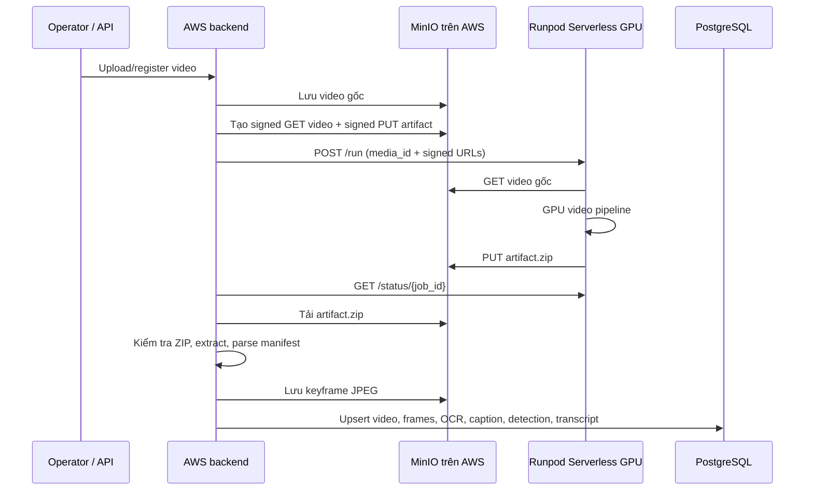

# Runpod Serverless cho pipeline xử lý video

Tài liệu này mô tả kiến trúc và cách vận hành pipeline video GPU của
HIT-MIRA khi máy chủ AWS không có GPU. Mô hình triển khai hiện tại là
**trusted backend + Runpod Serverless GPU worker**: AWS giữ MinIO/PostgreSQL,
Runpod chỉ xử lý một video qua URL ký có thời hạn.

## 1. Mục tiêu và phạm vi

Pipeline video thực hiện các tác vụ nặng như trích keyframe, OCR, caption,
object detection và ASR. Chúng không chạy trên CPU AWS. Thay vào đó, server
AWS gửi một job đến Runpod Serverless, nhận một file artifact ZIP, rồi tự
import kết quả vào MinIO và PostgreSQL.

Thiết kế này có các đặc tính:

- GPU chỉ được cấp khi có job (`active workers = 0`), nên không bị tính phí
  GPU khi rảnh.
- API key Runpod, tài khoản MinIO và PostgreSQL **không đi vào container
  Runpod**.
- Worker chỉ được cấp URL tải video và URL tải artifact lên, đều là URL ký
  ngắn hạn.
- Việc ghi dữ liệu chính thức vào MinIO/PostgreSQL diễn ra ở AWS, sau khi
  backend kiểm tra và import artifact.

## 2. Kiến trúc



### Phân tách trách nhiệm

| Thành phần | Trách nhiệm | Không làm |
|---|---|---|
| AWS backend | Đăng ký media, ký URL, submit/poll Runpod, import artifact | Không chạy inference GPU |
| MinIO | Lưu video gốc, keyframe, artifact tạm | Không cấp credential cho worker |
| Runpod worker | Tải video, chạy pipeline GPU, nén và upload artifact | Không kết nối PostgreSQL/MinIO bằng credential |
| PostgreSQL | Metadata video, frame và kết quả AI | Không nhận dữ liệu trực tiếp từ Runpod |

## 3. Các thành phần đã thêm vào repository

| Đường dẫn | Vai trò |
|---|---|
| `runpod_worker/Dockerfile` | Image GPU Python/CUDA cho Runpod |
| `runpod_worker/handler.py` | Runpod queue handler; tải video, chạy exporter, upload ZIP |
| `runpod_worker/requirements.txt` | Dependency inference chính của worker |
| `API/src/rag_video_anh/pipeline/runpod_client.py` | Gọi API Runpod: submit, status, cancel |
| `API/src/rag_video_anh/pipeline/minio_storage.py` | Tạo signed GET/PUT URL dùng endpoint public của MinIO |
| `scripts/runpod_video_job.py` | CLI trusted-backend: list, submit, wait/import, cancel |
| `scripts/export_video_artifacts.py` | Chạy pipeline và xuất layout artifact chuẩn |
| `scripts/import_media_outputs.py` | Import artifact về MinIO/PostgreSQL |

## 4. Image và tương thích GPU

Image đang triển khai:

```text
hoangtechcs/hit-mira-runpod-worker:v0.1.3
```

Image dùng CUDA 12.8 và PyTorch wheel `cu128`. Đây là yêu cầu quan trọng khi
Runpod cấp GPU NVIDIA Blackwell (`sm_120`, ví dụ RTX PRO 6000 MIG 24 GB).
PyTorch CUDA 12.4 không nhận kiến trúc này và worker sẽ fail ngay ở health
check CUDA.

`v0.1.3` cũng bao gồm package `minio`, vì `PipelineService` import helper
MinIO dù worker chỉ dùng URL ký.

Build/push image mới từ thư mục gốc:

```bash
sudo docker build --platform linux/amd64 \
  -f runpod_worker/Dockerfile \
  -t hoangtechcs/hit-mira-runpod-worker:vX.Y.Z .

sudo docker push hoangtechcs/hit-mira-runpod-worker:vX.Y.Z
```

Sau khi push, xác nhận tag đã public trước khi đổi endpoint:

```bash
sudo docker manifest inspect \
  hoangtechcs/hit-mira-runpod-worker:vX.Y.Z >/dev/null \
  && echo "manifest-visible"
```

> Không restart Docker trên AWS chỉ để build image: Docker đang chạy các dịch
> vụ như PostgreSQL, MinIO và Qdrant. Cần kiểm tra dung lượng trước khi build
> image CUDA lớn bằng `df -h /` và `sudo docker system df`.

## 5. Cấu hình AWS backend

Không commit các giá trị secret vào Git. Đặt trong `.env` trên server:

```dotenv
# MinIO mà backend AWS dùng nội bộ
MINIO_ENDPOINT=localhost:9000
MINIO_SECURE=false

# Endpoint public mà Runpod dùng qua signed URL
MINIO_PUBLIC_ENDPOINT=<public-ip-or-domain>:9000
MINIO_PUBLIC_SECURE=false

# Runpod: chỉ tồn tại trên backend
RUNPOD_API_KEY=<runpod-api-key>
RUNPOD_ENDPOINT_ID=<queue-endpoint-id>
RUNPOD_API_BASE_URL=https://api.runpod.ai/v2
```

`MINIO_PUBLIC_ENDPOINT` tách riêng khỏi `MINIO_ENDPOINT`: server AWS vẫn đi
qua `localhost`, còn URL ký gửi cho Runpod phải chứa một địa chỉ công khai mà
Runpod truy cập được.

Docker Compose đã truyền các biến Runpod/MinIO public vào service API. File
`.env.example` chỉ mô tả tên biến, không chứa giá trị thật.

## 6. Cấu hình Runpod Serverless

Tạo endpoint kiểu **Serverless → Queue based → Docker image** với các giá trị
sau:

| Trường | Giá trị khuyến nghị |
|---|---|
| Container image | `hoangtechcs/hit-mira-runpod-worker:v0.1.3` |
| Compute | GPU |
| GPU memory | 24 GB (`AMPERE_24`) |
| GPU types | Ưu tiên L4, RTX A5000, RTX 3090; có thể cho phép Blackwell 24 GB vì image CUDA 12.8 hỗ trợ `sm_120` |
| Max workers | `1` cho smoke test/batch nhỏ |
| Active workers | `0` để scale-to-zero khi rảnh |
| Execution timeout | `1800` giây hoặc lớn hơn nếu xử lý video dài |
| Container disk | tối thiểu `20 GB` |
| FlashBoot | Bật (Standard) |
| HTTP/TCP ports | Để trống; endpoint dùng queue API, không cần public port |

Khi đổi image hoặc cấu hình, Runpod tạo một **Release** mới. Chỉ submit job
khi endpoint hiển thị `Ready`. Trong tab Releases phải thấy đúng tag image
mới trước khi test.

## 7. Vận hành hằng ngày

Tất cả lệnh dưới đây chạy tại AWS backend:

```bash
cd /home/ubuntu/HIT-MIRA-Multimodal-RAG
export PYTHONPATH=API
```

### 7.1 Upload và đăng ký video

```bash
python scripts/upload_crawled_data_to_minio.py \
  data/crawled/<event-or-post-folder> --prefix events

python scripts/register_minio_videos.py \
  --prefix events/<event-or-post-folder>

python scripts/runpod_video_job.py list
```

Lệnh `list` in ra các `media_id` của video đã được đăng ký. Dùng đúng
`media_id` video ở bước kế tiếp.

### 7.2 Submit job

```bash
python scripts/runpod_video_job.py submit <media_id>
```

Kết quả có dạng:

```json
{
  "runpod_job_id": "...-u2",
  "runpod_status": "IN_QUEUE",
  "media_id": "...",
  "artifact_key": "runpod-artifacts/<media_id>/<run-id>.zip"
}
```

`IN_QUEUE` ngay sau submit là bình thường. Worker serverless có thể cần vài
giây để được cấp GPU. URL ký mặc định sống 2 giờ; không tái sử dụng job đã
chờ quá lâu hoặc job thuộc release lỗi.

### 7.3 Chờ và import kết quả

```bash
python scripts/runpod_video_job.py wait \
  <runpod_job_id> \
  <artifact_key>
```

Khi trạng thái `COMPLETED`, CLI tự động:

1. tải ZIP từ MinIO;
2. kiểm tra ZIP không có path traversal;
3. extract artifact;
4. import keyframe, metadata và các kết quả AI vào MinIO/PostgreSQL.

### 7.4 Chạy trọn vòng cho một hoặc nhiều video

Nếu muốn submit, chờ Runpod hoàn tất và import artifact trong một lệnh:

```bash
python scripts/runpod_video_job.py process <media_id>
```

Chạy nhiều video chỉ định rõ:

```bash
python scripts/runpod_video_job.py process <media_id_1> <media_id_2> --continue-on-error
```

Chạy các video đã đăng ký trong PostgreSQL, mới nhất trước:

```bash
python scripts/runpod_video_job.py process --all --limit 10 --continue-on-error
```

Lệnh `process` xử lý tuần tự từng video để signed URL không hết hạn trong lúc
job sau còn nằm chờ queue. Khi cần tăng throughput, tăng `workersMax` trên
Runpod trước rồi mới tách thêm orchestration song song.

### 7.5 Kiểm tra endpoint/job

```bash
python scripts/runpod_video_job.py health
python scripts/runpod_video_job.py status <runpod_job_id>
```

### 7.6 Hủy job không còn dùng được

Ví dụ khi endpoint/release lỗi hoặc URL ký đã hết hạn:

```bash
python scripts/runpod_video_job.py cancel <runpod_job_id>
```

Sau khi hủy, submit lại để có `runpod_job_id`, `artifact_key` và signed URL
mới.

## 8. Artifact contract

Worker xuất một ZIP chứa một thư mục `outputs/<media_id>/` tương thích với
Artifact flow:

```text
manifest.json
frames/frame_000123.jpg
ocr.json
captions.json
detections.json
transcript.json
normalized_metadata.json
run_log.txt
```

Chi tiết schema artifact nằm ở
[video-artifact-flow.md](video-artifact-flow.md).

## 9. Kết quả smoke test đã thực hiện

Smoke test trên một video đã được đăng ký ở MinIO đã hoàn tất:

- Runpod worker: image `v0.1.3`, GPU 24 GB;
- trạng thái job: `COMPLETED`;
- thời gian thực thi GPU: khoảng 23 giây;
- artifact ZIP được upload về MinIO và import thành công;
- PostgreSQL xác nhận video còn tồn tại và có 3 media frame dẫn xuất.

Điều này xác nhận toàn bộ đường đi AWS → Runpod → MinIO/PostgreSQL hoạt động.

## 10. Xử lý sự cố

| Hiện tượng | Nguyên nhân thường gặp | Cách xử lý |
|---|---|---|
| `IN_QUEUE` lâu | GPU type thiếu nguồn cung hoặc worker chưa được cấp | Trong Runpod chọn thêm GPU 24 GB có supply cao; kiểm tra Workers/Release; không submit lặp lại nhiều job |
| `All workers are unhealthy` | Image hoặc start command lỗi | Mở Worker Logs, chọn Container, xem traceback cuối |
| `sm_120 is not compatible` / CUDA init fail | PyTorch CUDA 12.4 chạy trên Blackwell | Dùng image CUDA/PyTorch 12.8+ (`v0.1.3`) |
| `ModuleNotFoundError: minio` | Image thiếu dependency pipeline | Dùng `v0.1.3` trở lên |
| `pipeline exited with code 1` | Lỗi bên trong exporter/pipeline | Xem Container Logs của worker đúng request; handler hiện để stdout/stderr pipeline đi thẳng vào Runpod Logs |
| Signed download URL trả `403` khi test `HEAD` | URL được ký cho HTTP `GET` | Test bằng `GET`, đúng phương thức worker sử dụng |
| Worker hết disk | Model/artifact không vừa container disk | Tăng Container disk lên ít nhất 20 GB |
| Không thấy tag Docker Hub | Push chưa hoàn tất | Kiểm tra bằng `docker manifest inspect`; chỉ đổi endpoint sau khi tag visible |

## 11. Bảo mật và vận hành production

- Không gửi `RUNPOD_API_KEY`, MinIO access key hoặc secret key vào job payload,
  Docker image, Git hay frontend.
- MinIO port `9000` hiện phải công khai để Runpod truy cập signed URLs. Chỉ
  nên dùng tạm cho demo qua HTTP raw IP; production nên dùng domain + TLS
  (`MINIO_PUBLIC_SECURE=true`) hoặc mạng riêng phù hợp.
- Không public MinIO Console port `9001`.
- Giới hạn SSH port `22` theo IP quản trị (`/32`), không dùng `0.0.0.0/0`.
- Chỉ mở `80/443` khi có dịch vụ web/reverse proxy cần thiết. Các port khác
  phải có lý do rõ ràng và source CIDR tối thiểu.
- Bảo vệ MinIO bằng credential mạnh, không dùng credential mặc định.
- Xem artifact ZIP là dữ liệu tạm; đặt lifecycle/cleanup cho prefix
  `runpod-artifacts/` nếu chạy batch dài ngày.

## 12. Giới hạn hiện tại và hướng phát triển

Hiện tại đây là workflow CLI có kiểm soát trên trusted backend. Nó chưa tạo
API endpoint/background worker tự động cho người dùng web. Bước tiếp theo
hợp lý là thêm một service/job queue nội bộ gọi `submit`, lưu `runpod_job_id`
vào bảng job, poll/import nền và trả trạng thái qua API/UI.

